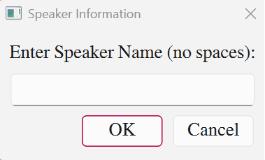

# Assignment 4: Mini ASR Project

## Setup (once per machine)

လိုအပ်တဲ့ software တွေ install လုပ်ဖို့နဲ့ mic permission စတာတွေအတွက် [SETUP.md](SETUP.md) ကို အရင်ဖတ်ပါ။  
အတိုချုပ် -  

```bash
# repo root ရဲ့ .venv ထဲကို
../.venv/bin/python -m pip install -r requirements.txt
# macOS မှာ PortAudio system library လည်း လိုတယ်
brew install portaudio
```

## Step 1: Recording or Speech Corpus Building

ဆရာ update လုပ်ပေးထားတဲ့ **recorder.py (ver. 0.91)** ကို အသုံးပြုပြီး အသံသွင်းကြပါ။  
(`recording_tool/recorder.py` = ver 0.91 ။ မူရင်း version တွေကို `recording_tool/old_versions/` မှာ သိမ်းထားတယ်။)  
အောက်ပါအတိုင်း ငါးခါ run ပါ။ B2-Assignment4/ folder ထဲကနေ run ပါ။  

ဥပမာ။။ နာမည်က "ဝင်းဦး" ဆိုရင် ပထမဆုံး တစ်ခေါက် အသံသွင်းတဲ့အခါမှာ "WinOO_Rec1" လိုပေးပြီး တစ်ကြောင်းစီကို တစ်ခါစီ ပုံမှန်ဖတ်သွားပါ။ 

**နည်းလမ်း ၁ - launcher script (အလွယ်ဆုံး၊ macOS/Linux):**

```bash
./record.sh WinOo 1     # -> recordings/WinOo_Rec1/
./record.sh WinOo 2     # -> recordings/WinOo_Rec2/
./record.sh WinOo 3
./record.sh WinOo 4
./record.sh WinOo 5
```

(macOS မှာ Finder ကနေ `record.command` ကို double-click လုပ်လည်း ရတယ်။)

**နည်းလမ်း ၂ - recorder.py ကို တိုက်ရိုက် (Windows အပါအဝင်):**

```bash
# macOS / Linux
../.venv/bin/python recording_tool/recorder.py -p mini-asr-v1.txt -d recordings/WinOo_Rec1 -m ordered

# Windows (PowerShell)
python .\recording_tool\recorder.py -p .\mini-asr-v1.txt -d .\recordings\WinOo_Rec1 -m ordered
```

`WinOo_Rec1` ... `WinOo_Rec5` အထိ ငါးခါ။ `-d` folder name ကိုပဲ Rec1..Rec5 ပြောင်းပါ။

တစ်ခေါက်စီ run တိုင်းမှာအောက်ပါအတိုင်း ပေါ်လာမယ့် Speaker Information dialogue box မှာလည်း ကိုယ့်နာမည် အပြည့်အစုံကို စပေ့စ်မခြားပဲ ရိုက်သွားပါ။   

<p align="center">
  
</p>  
<div align="center">
  Fig. Speaker Information UI
</div> 

<br />  

## Recording Guide

ဒီ corpus က စာကြောင်းရေ ၁၅၀ ပဲ ရှိတဲ့ speech corpus အသေးလေးပါ။ ဒါပေမဲ့ လက်တွေ့ မြန်မာစာ ASR ကို အစအဆုံး လုပ်တတ်ဖို့ရည်ရွယ်ထားပါတယ်။ အသံဖမ်းတဲ့အခါမှာ အောက်ပါ အချက်အလက်တွေကို ဂရုစိုက်ပါ။ အတိအကျလိုက်နာပါ။  

- အသံတစ်ခေါက်သွင်းတိုင်းမှာ စာကြောင်းတစ်ကြောင်းစီကို (prompt) တစ်ခါစီ ဖတ်သွားပါ။
- အသံစမသွင်းခင်မှာ အရင်ဆုံး အသံထွက်ဖတ်တာမျိုး လုပ်သင့်ပါတယ်။ အထူးသဖြင့် တစ်ချို့နေရာတွေမှာ "ထောင်"ဂဏန်းလား၊ "သောင်း"ဂဏန်းလား ဆိုတာကို မမှားစေဖို့နဲ့ တချို့နေရာတွေမှာ နံပါတ်တွေကို တစ်လုံးခြင်းစီ ရွတ်ဖတ်တာမျိုး လုပ်ရတာကို မမေ့အောင်လို့ပါ။
- စကားစမပြောခင်နဲ့ ပြောပြီးတဲ့အခါမှာ short silence (~0.5–1 s) ထည့်ဖြစ်အောင်လုပ်ပါ။
- အသံသွင်းပြီးသားကို နားထောင်ကြည့်ပြီးမှ save လုပ်ပါ။
- အသံသွင်းနေစဉ် တလျှောက်မှာ မိုက်ကရိုဖုန်း ရှိတဲ့နေရာကနေ ဝေးသွားတာမျိုး ပိုနီးသွားတာမျိုး မလုပ်ပဲ၊ ခေါင်းကို ငြိမ်အောင် ထားကြဖို့ အကြံပြုချင်ပါတယ်။
- ပန်ကာဖွင့်ထားတဲ့နေရာ၊ လေတအားတိုက်တဲ့နေရာ၊ ကားဟွန်းသံတွေကြားနေရတဲ့နေရာ၊ သီချင်းသံ ဆူညံတဲ့နေရာမျိုးတွေကိုရှောင်ပြီး အသံသွင်းရပါလိမ့်မယ်။
- ကျောင်းသား (သို့) speaker တစ်ယောက်စီအတွက်က အနည်းဆုံး ၅ ခါ သွင်းပါ။ လေးခါမြောက်ကို ပုံမှန်ထက် နည်းနည်း မြန်မြန် ပိုဖတ်တာမျိုး၊ သွက်သွက် ဖတ်တာမျိုး လုပ်ပြီး၊ ငါးခါမြောက်ကိုတော့ စကားပြောဟန် ပိုဆန်အောင် (ဆိုလိုတာက အသံကို ပို သဘာဝကျအောင်၊ စာဖတ်နေတာမျိုး မဟုတ်အောင်) ပြောတာမျိုး လုပ်ကြပါ။
- 16 kHz mono WAV ဖိုင်အနေနဲ့သိမ်းအောင် recorder.py မှာ setting ချိန်ထားပြီးသားပါ။ အသံသွင်းပြီးသားဖိုင်ကို ဝင်ပြင်တာမျိုး၊ format ပြောင်းတာမျိုး ရှောင်ကြဉ်ပါ။

## Step 2: Speech Corpus Submission

zip မလုပ်ခင် pass folder တစ်ခုစီကို validate လုပ်ပါ (format / orphan / duplicate စစ်ပေးတယ်) -

```bash
../.venv/bin/python tools/validate_recording.py recordings/WinOo/Rec1 --expect-prompts 150
../.venv/bin/python tools/validate_recording.py recordings/WinOo/Rec*   # pass အားလုံး
```

`error` ၀ ဖြစ်မှ တင်ပါ။ speaker တစ်ယောက်ရဲ့ pass ငါးခုကို folder တစ်ခုအောက်မှာ စုပြီး zip လုပ်ပါ။

> `wav.scp` ထဲက path တွေက အသံသွင်းတဲ့ machine ရဲ့ absolute path မို့ Kaldi box ပေါ်မှာ ပြန်ဆောက်ဖို့လိုတယ်။
> pass/speaker တွေ ပေါင်းစည်းဖို့ `tools/merge_data_dir.py` သုံးပါ -
> ```bash
> ../.venv/bin/python tools/merge_data_dir.py -o data/train recordings/*/Rec*
> ```
> ရလဒ်က byte-sorted၊ duplicate ဖယ်ထား၊ `spk2utt` ပါ ပါလာမယ်။

အဖွဲ့ခေါင်းဆောင်က ကိုယ့်အဖွဲ့ဝင်တွေအားလုံး အသံသွင်းတာပြီးသွားရင် ဒေတာအားလုံးကို zip လုပ်ပြီး raw-corpus/ ဆိုတဲ့ ဖိုလ်ဒါအောက်မှာ တင်ပေးတာ ဒါမှမဟုတ်၊ ဆရာ့ကို GoogleDrive နဲ့ ရှဲတာမျိုး လုပ်ကြရအောင်။  

## Step 3: Building ASR Model

(A working reference pipeline - data prep, lang/LM, MFCC, mono->tri1->tri2->tri3->MMI, WER/SER, in one notebook - lives in `step3_asr/mini_asr_kaldi.ipynb`. See `step3_asr/README.md`.)

- Kaldi ကိုသုံးပြီး monophone, triphone HMM-GMM မော်ဒယ်တွေဆောက်ကြည့်ပြီး baseline result ထုတ်ပါ။
- တခြား advanced model (e.g. DNN) ကိုယ်စမ်းချင်တာကို အနည်းဆုံး တစ်မျိုးဆောက်ပြီး baseline ရလဒ်ထက် သာအောင်ကြိုးစားပါ။
- ASR မှာက training/dev/test ကို speaker အရေအတွက်နဲ့ပဲ ခွဲပါတယ်။
- အဖွဲ့တစ်ဖွဲ့စီမှာ ၁၀ယောက်ခန့် ရှိတာမို့ testing ကို ယောက်ျားလေးတစ်ယောက်၊ မိန်းကလေးတစ်ယောက် (စုစုပေါင်း နှစ်ယောက်ရဲ့ အသံဖိုင်အကုန်) နဲ့ လုပ်ကြရအောင်။ 
- ASR pipeline တစ်ခုလုံး (ဆိုလိုတာက ဒေတာပြင်ဆင်တာကနေ ---> Evaluation အဆင့်အထိ) ကို Jupyter notebook or Jupyter lab ကို သုံးပြီး လုပ်ပါ။
- Evaluation ကို WER (Word Error Rate), (Syllable Error Rate) နှစ်မျိုးနဲ့ လုပ်ကြပါ။  
- Assignment 4 report ကိုလည်း အဖွဲ့ခေါင်းဆောင်ကပဲ ဆရာ့ဆီကို တင်ပေးပါ။
- အတန်းထဲမှာ presentation (about 20 min) လုပ်ပြီး ဆွေးနွေးတာကို လည်း လုပ်ကြမယ်။

## Deadline

- အသံသွင်းတာက တပတ်အတွင်း အားလုံး ပြီးအောင် လုပ်ကြပါ။
- Jupyter notebook or experimental report ကိုတော့ Sept 10, 2026 မှာတင်ပါ။
- Group presentation ကိုတော့ Sept 12, 2026 (စနေနေ့) မှာ လုပ်ဖို့ စဉ်းစားထားတယ်။


